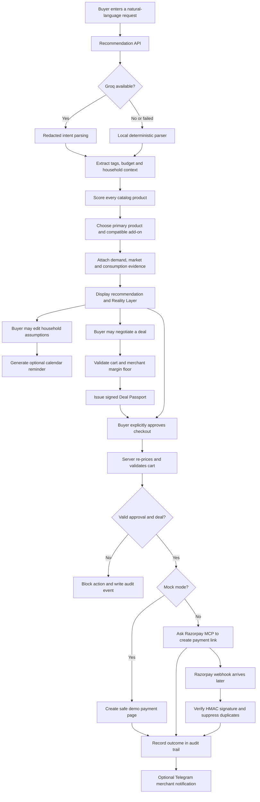

# Commergent — Flow of Events and Component Guide

This document explains what happens from the moment a buyer enters a request until a Razorpay test-mode payment link is created. It also explains what every major website component means, why it matters, and what is real versus simulated in the current build.

## One-Sentence Product Description

Commergent is an explainable merchant-growth agent that recommends products, estimates replenishment needs, evaluates market scenarios, negotiates a safe discount, and creates a Razorpay payment link only after explicit buyer approval.

## Complete Flow of Events



## Event-by-Event Explanation

### 1. Buyer Request

The buyer enters a normal sentence such as:

> Coffee and breakfast for a two-member household under ₹750.

The request can contain:

- a product need;
- a spending limit;
- family size;
- estimated daily usage;
- lifestyle or category preferences.

**Significance:** A buyer does not need to know product IDs, catalog filters, or checkout APIs. Natural language becomes a structured commerce request.

**Money status:** No payment, order, or payment link exists.

### 2. Intent Parsing

The recommendation service extracts useful information such as `coffee`, `breakfast`, the ₹750 budget, and the household profile.

Two paths are supported:

- **Groq parser:** Used when configured. Contact-like text such as email addresses and phone numbers is redacted before the request is sent.
- **Local fallback:** Uses deterministic rules when Groq is unavailable, unconfigured, times out, or returns an error.

**Significance:** The storefront continues working even if the optional AI provider fails. The AI helps interpret intent, but it never receives authority to set prices or move money.

### 3. Server Catalog

The catalog contains known product IDs, names, descriptions, pack sizes, categories, prices, tags, and whether an item can be replenished.

**Significance:** This is the authoritative source for checkout pricing. Values submitted by the browser are not trusted as prices.

**Real-world equivalent:** A merchant product information system, inventory database, Shopify catalog, ERP, or commerce platform catalog.

### 4. Product Scoring

Every catalog candidate receives an explainable score:

```text
total score = intent relevance points + demand adjustment
```

The current scoring model awards four points for every matching catalog tag. A rising demand signal adds points, a stable signal has no effect, and a falling signal can reduce the score.

The engine also checks whether each product fits the buyer's budget. It then chooses:

- one primary product;
- an optional compatible add-on that still fits the remaining budget.

**Significance:** The merchant can grow basket value through a controlled upsell without hiding why the product was selected.

### 5. Demand Radar

The Demand Radar shows which product topics are rising, stable, or falling in the demo snapshot.

**Current data status:** Simulated and clearly labelled. It is not live Google Trends or a sales forecast.

**Significance:** Demand can influence ranking or campaign decisions, but it does not directly change the amount charged to the buyer.

**Production replacement:** An approved Google Trends feed, merchant search analytics, sales velocity, inventory movement, or first-party demand data.

### 6. Recommendation Result

The result contains product cards, the total price, a possible cross-sell, demand direction, and a plain-language explanation.

**Significance:** It serves both sides of the transaction:

- the buyer sees relevant products within budget;
- the merchant sees the possible incremental revenue from the add-on.

### 7. Reality Layer

The Reality Layer labels every important source before the buyer acts:

| Source | Current status | Meaning |
| --- | --- | --- |
| Catalog and checkout | Authoritative | Server prices are used for payment |
| Buyer intent | External or local | Groq parser or deterministic fallback |
| Demand | Simulated | Demo snapshot used only for ranking |
| Market prices | Simulated | Illustrative competitor scenarios |
| Consumption | Assumption | Editable household planning estimate |

**Significance:** Judges and buyers can distinguish verified transactional data from estimates. This prevents the interface from presenting simulated intelligence as a live fact.

### 8. Household Consumption Planner

The buyer can change family size and daily usage. The planner estimates:

- serving size;
- daily burn rate;
- approximate pack lifespan;
- a suggested day to review stock.

The formula is visible in the interface.

**Current data status:** Illustrative planning assumptions, not measured customer behavior.

**Significance:** It turns a one-time product recommendation into a useful replenishment plan without creating an automatic financial commitment.

### 9. Calendar Reminder

For replenishable products, the buyer can download an `.ics` calendar event for the suggested stock-review date.

The event explicitly tells the buyer to review stock before purchasing.

**Significance:** This is a real working integration that improves repeat-purchase retention while remaining safe. It does not create an Autopay mandate, subscription, order, or automatic charge.

Durable items such as a steel utensil set do not receive a replenishment forecast.

### 10. Market and Quick-Commerce Scenario

The market section compares the local merchant with example marketplace or quick-commerce channels. It separates:

- item price;
- delivery fee;
- handling or surge fee;
- landed total;
- estimated delivery time;
- stock status.

**Current data status:** Deterministic simulated scenarios. No Amazon, Flipkart, BigBasket, Blinkit, Zepto, or Amazon Fresh pricing API is queried.

**Significance:** The panel can see the product vision—an agent that reasons about total buyer cost—without the demo making unsupported live-price claims. These values never alter checkout pricing.

### 11. Decision Dashboard

The Decision section answers “Why this product?” It shows:

- the published scoring formula;
- detected intent tags;
- relevance and demand points;
- selected products;
- rejected alternatives;
- the reason each alternative lost;
- budget usage;
- whether the budget was capped;
- a counterfactual explaining whether demand changed the winner.

**Significance:** This is the main explainability feature. A recommendation can be audited instead of being accepted as an unexplained model output.

### 12. Merchant Negotiation

The buyer can request a percentage discount, target total, or volume deal. The server first validates all product IDs and quantities.

The Merchant Sentinel then evaluates two limits:

1. demand-based discount flexibility;
2. the private merchant cost and minimum margin floor.

The strictest limit wins. The offer can be accepted, counter-offered, or rejected.

**Significance:** The agent can grow conversion without giving away more margin than the merchant permits.

### 13. Private Merchant Economics

Product cost and minimum-margin settings are stored only on the server. They are not included in the public catalog response.

**Current data status:** Demo merchant economics.

**Real-world equivalent:** Cost of goods, campaign constraints, inventory ageing, customer segment rules, and margin policies from an ERP or pricing service.

**Significance:** A buyer can understand the policy without seeing sensitive internal cost figures.

### 14. Signed Deal Passport

When a discount is approved, the server creates a signed Deal Passport containing:

- version number;
- agent action ID;
- exact cart fingerprint;
- deal code;
- authorized discount;
- expiry time.

Checkout verifies the HMAC signature using a server-only secret. If the buyer changes an item or quantity, uses the deal with another action, changes the token, or waits until it expires, the deal is rejected.

**Significance:** The browser cannot invent its own discount. The authorization travels with the checkout request in a tamper-evident form.

**Demo limitation:** Persistent single-use enforcement requires a durable database or Redis store. The current in-memory idempotency mechanism is suitable for the buildathon demo, not multi-instance production deployment.

### 15. Explicit Buyer Approval

The agent stops in an `awaiting-buyer-approval` state. The buyer must click **Approve & create payment link**.

**Significance:** Recommendation and negotiation are reversible. Creating a payment link is a money-related action, so it is visibly gated by the human buyer.

### 16. Money Policy Sentinel

At checkout, the server independently verifies:

- explicit approval was received;
- the cart is not empty;
- all IDs exist in the server catalog;
- quantities are integers from 1 to 3;
- cart lines are unique;
- the cart contains no more than five unique items;
- the total is at most ₹10,000;
- any discount has a valid Deal Passport;
- the final amount remains inside the permitted boundary.

**Significance:** Even if someone edits the browser request, the backend remains the final authority.

### 17. Razorpay MCP or Mock Checkout

The execution path depends on configuration:

- `PAYMENTS_MOCK_MODE=true`: creates a safe local demo payment page.
- `PAYMENTS_MOCK_MODE=false`: asks Razorpay Hosted MCP to call `create_payment_link` using Razorpay test-mode credentials.

Only a one-time payment link is claimed. The project does not present Payment Links as UPI Autopay mandates.

**Significance:** Judges can test the entire interaction without credentials, while the same gated architecture can connect to Razorpay test mode.

### 18. Idempotency

The action ID is used to avoid creating another checkout result when the same successful action is submitted repeatedly.

**Significance:** Double-clicks and client retries should not create duplicate payment links.

**Demo limitation:** The idempotency store is currently in memory. Production deployment should use Redis or a database with a unique constraint.

### 19. Graceful Failure

The **Test graceful MCP failure** button deliberately simulates a Razorpay MCP timeout.

The app:

- stops checkout;
- creates no payment link;
- tells the buyer that nothing was charged;
- records the failure reason in the audit log;
- can optionally alert the merchant through Telegram.

**Significance:** The buildathon requires at least one handled failure. This demonstrates that an external-tool failure does not become an ambiguous payment state.

### 20. Razorpay Webhook Verification

After a real Razorpay test payment event, Razorpay can call the webhook route. The route verifies the HMAC-SHA256 signature before accepting the event and tracks Razorpay event IDs to detect duplicates.

**Significance:** A public caller cannot simply claim that a payment succeeded. Payment state changes must be backed by a valid Razorpay signature.

**Production requirement:** Store processed webhook event IDs and resulting payment state in a durable database.

### 21. Audit Trail

The right-hand panel has two views:

- **Transaction Story:** A buyer-friendly causal explanation of the current journey.
- **Raw Audit Log:** Technical events, levels, timestamps, action IDs, checks, and failure details.

The audit trail records recommendation, negotiation, policy, payment-link, failure, webhook, Telegram, and replay events.

**Significance:** Every money-related action can be explained after the fact. This is useful for merchant support, debugging, compliance review, and judge evaluation.

### 22. Telegram Merchant Notification

When Telegram is configured, the backend can notify the merchant about successful payment-link creation or a stopped checkout.

**Significance:** The merchant receives operational visibility without remaining on the dashboard.

Telegram is an alert channel only. It does not determine payment truth; Razorpay webhook verification and server records do that.

## Visible Website Components

| Website component | What it means | Why it matters |
| --- | --- | --- |
| Prompt box | Natural-language shopping request | Makes the catalog accessible to human and AI buyers |
| Example buttons | Prepared buildathon scenarios | Gives judges a fast and repeatable demo |
| Reality Layer | Provenance labels for every signal | Separates authoritative facts from estimates |
| Cart tab | Selected primary item and add-on | Demonstrates conversion and basket growth |
| Planning tab | Editable household usage model | Supports retention and reorder planning |
| Calendar link | Downloadable stock-review event | Provides real utility without automatic payment risk |
| Market tab | Landed-cost scenarios | Explains merchant positioning and buyer trade-offs |
| Decision tab | Score and rejection evidence | Makes recommendations auditable |
| Deal tab | Merchant-controlled negotiation | Improves conversion while protecting margin |
| Signed deal badge | Verified discount authorization | Prevents browser-created discounts |
| Approval button | Human money-action gate | Prevents silent autonomous checkout |
| Failure button | Deliberate MCP timeout | Proves safe error handling |
| Transaction Story | Plain-language action lineage | Helps buyers and judges understand the journey |
| Raw Audit Log | Technical event evidence | Supports operations and debugging |

## What Is Real in the Current Build?

| Capability | Status |
| --- | --- |
| Server catalog and checkout pricing | Real application logic |
| Product scoring and budget rules | Real deterministic logic |
| Signed Deal Passport verification | Real HMAC verification |
| Merchant margin-floor enforcement | Real logic using demo economics |
| Quantity and spending limits | Real server enforcement |
| Calendar `.ics` generation | Real downloadable integration |
| Razorpay Hosted MCP client | Real integration when test credentials are configured |
| Razorpay webhook signature verification | Real verification logic |
| Telegram notifications | Real integration when configured |
| Demand values | Simulated demo snapshot |
| Marketplace and quick-commerce values | Simulated deterministic scenarios |
| Consumption rates | Editable planning assumptions |
| Audit and idempotency storage | In memory for the demo |

## Judge-Ready Demonstration Order

1. Submit the coffee household prompt.
2. Explain the Reality Layer before showing any result.
3. Show the primary product, add-on, and potential basket uplift.
4. Change the household size and download the calendar reminder.
5. Show the simulated landed-cost comparison and its disclaimer.
6. Open the Decision tab and explain why one rejected product lost.
7. Ask for a 10% discount and show the Signed Deal Passport.
8. Explain that changing the cart invalidates the signed deal.
9. Click the explicit approval button and open the mock or Razorpay test payment link.
10. Return and run the graceful-failure demonstration.
11. Finish with the Transaction Story and Raw Audit Log.

## Suggested Panel Pitch

> Most shopping agents optimize only for convenience. Commergent also protects the merchant and the buyer. It makes every source visible, every recommendation explainable, every discount policy-bound, and every payment action server-validated and human-approved.

## Main Code Map

| Responsibility | File |
| --- | --- |
| Storefront and decision dashboard | `app/page.tsx` |
| Recommendation and scoring | `lib/agent.ts` |
| Server-authoritative products | `lib/catalog.ts` |
| Demand demo snapshot | `lib/demand-trends.ts` |
| Household planning estimates | `lib/consumption-engine.ts` |
| Market scenario comparison | `lib/market-comparison.ts` |
| Quick-commerce scenarios | `lib/quick-commerce.ts` |
| Negotiation policy | `lib/negotiation.ts` |
| Private demo costs and margin floors | `lib/merchant-economics.ts` |
| Signed discount authorization | `lib/deal-passport.ts` |
| Money-action boundaries | `lib/policy.ts` |
| Checkout API | `app/api/checkout/route.ts` |
| Calendar reminder API | `app/api/replenishment/calendar/route.ts` |
| Razorpay MCP connection | `lib/razorpay-mcp.ts` |
| Razorpay webhook receiver | `app/api/webhooks/razorpay/route.ts` |
| Audit event store | `lib/audit.ts` |
| Telegram alerts | `lib/telegram.ts` |
